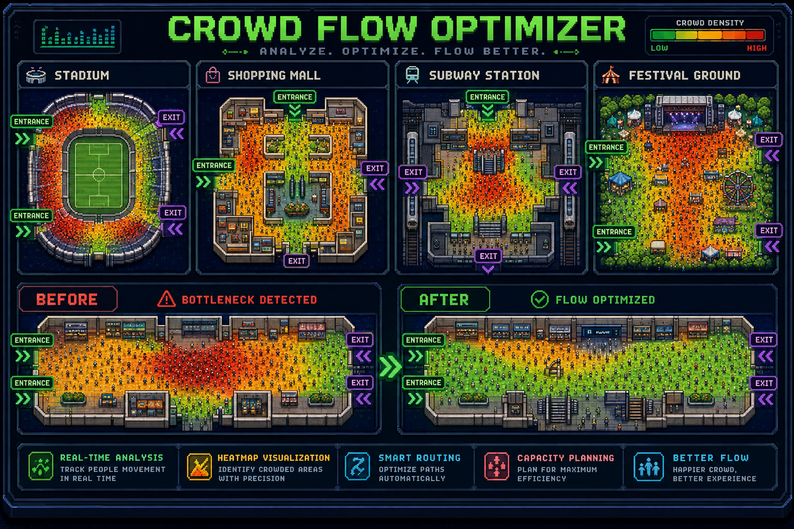

# Concourse



Simulate a venue, predict where the crowd will jam, and route around it — before the queue
becomes a crush.

Upload a venue layout, and the system runs a live agent simulation of the crowd moving through
it, measures density per zone, asks an AI layer which zones are about to become dangerous, and
diverts people away from them. A hidden baseline run executes alongside with rerouting off, on
the same crowd and the same random seed, so the summary shows a real before/after rather than
an estimate.

---

## Repository layout

| Path | What it is |
|---|---|
| [`backend/`](backend/) | Spring Boot. Accounts, sessions, the agent simulation, density detection, rerouting, WebSocket broadcast. Port **8080**. |
| [`ai-service/`](ai-service/) | Python FastAPI. Per-zone risk prediction and the operator advisory. Port **8000**. |
| [`frontend/`](frontend/) | React + Vite. Three portals over one live map. Port **5173**. |
| [`ml/`](ml/) | Model training and export to the Hugging Face Hub. Not needed to run the app. |
| [`sample-data/`](sample-data/) | A ready-made venue layout and event schedule. |
| [`mobile/`](mobile/) | Flutter attendee app. Live zone congestion, route to the nearest exit, optional GPS. |
| [`ci/`](ci/) | Jenkins, itself in a container. Not needed to run the app. |
| [`docs/`](docs/) | API contract, system design, auth and database, CI/CD, demo script. |

---

## Running it

**In one command, if you have Docker:**

```bash
docker compose up --build
```

That brings up Postgres, the AI service, the backend and the built frontend together —
<http://localhost:5173>. It runs the backend under its cloud profile against Postgres, which is
the shape a deployment has rather than the shape a laptop has. See
[`docs/ci-cd.md`](docs/ci-cd.md) for the configuration, and for the Jenkins pipeline that builds
and tests all of it.

**Or run the three processes directly**, which is the better loop for development. Start them in
any order — each degrades gracefully while the others are down.

The mobile app is optional either way, and needs only the backend — see [`mobile/`](mobile/).

### 1. AI service (port 8000)

```bash
cd ai-service
python -m venv .venv
.venv/Scripts/python -m pip install -r requirements.txt   # macOS/Linux: .venv/bin/python

# Optional: the layout→graph pipeline behind Layout Studio (OpenCV/NumPy/scikit-image).
# Everything else runs without it; only /layout/* is unavailable when it is missing.
.venv/Scripts/python -m pip install -r requirements-layout.txt

.venv/Scripts/python -m uvicorn app.main:app --port 8000
```

No configuration, no API token and no model download. See [Which model answers](#which-model-answers).

`GET /health` reports `layout.available`, so the UI can say "AI tracing is unavailable"
rather than letting an operator upload a plan and get a 404. The pipeline runs CV-only by
default; set `LAYOUT_VLM_ENABLED=true` (see `.env.layout.example`) to add the Qwen2.5-VL
semantic stage, which needs the extra GPU dependencies listed in `requirements-layout.txt`.

### 2. Backend (port 8080)

```bash
cd backend
./mvnw spring-boot:run

if ran in regular cmd:
mvnw spring-boot:run

```

Needs JDK 21 or newer. **No database to install.** Accounts are written to an H2 file under
`backend/data/`, created on first boot, with Flyway owning the schema. A deployment swaps in
Postgres via `SPRING_PROFILES_ACTIVE=cloud` and no code change.

Optional, and only if you want the extras:

```bash
cp secrets.example.yml secrets.yml   # then fill in
```

That seeds an allowlisted admin account and lets password-reset codes go out by email. Without
it the app still boots — the admin is simply not seeded, and reset codes come back in the HTTP
response instead of an inbox. Details in [`docs/auth-and-database.md`](docs/auth-and-database.md).

### 3. Frontend (port 5173)

```bash
cd frontend
npm install
npm run dev
```

Then open <http://localhost:5173>, go to **Access → Client**, and register an account — 8 to 72
characters with at least one letter and one number. Press **Create session**: the sample arena is
pre-loaded, so it is one click from there to a running crowd.

Accounts are real. Registration writes a row, sign-in returns a JWT the frontend keeps in
`localStorage`, and `POST /sessions` refuses anything without a `CLIENT` or `ADMIN` token.
Walker and client are self-service; the admin console is allowlisted and cannot be requested at
the form. See [`docs/auth-and-database.md`](docs/auth-and-database.md).

---

## How the pieces talk

```
Browser ──HTTP──> Spring Boot ──HTTP /analyze──> FastAPI ──(optional)──> Hugging Face
   ^                   │                            │
   └──── WebSocket ────┘                     app/scoring.py
        live frames                       (offline, always available)
```

1. The frontend uploads a venue and opens a session: `POST /sessions`.
2. Spring ticks that session every 100 ms — agents move under a social force model, and each
   zone's density is measured.
3. When density has moved enough to be worth asking about, Spring calls the AI service's
   `POST /analyze` with the graph, current density, recent history and run context. **This call
   is always off the tick thread** — a session must never stall waiting on a model.
4. The AI service returns per-zone risk and a written advisory.
5. Zones that go critical trigger a Dijkstra reroute; everyone heading into the jam is diverted.
6. Every other tick, the whole state is broadcast to every connected viewer over
   `WS /sessions/{id}/stream`.

If the AI service is down, the session keeps running and keeps broadcasting measured density —
degraded, not broken. The full contract is in [`docs/api-contract.md`](docs/api-contract.md).

---

## Which model answers

Three paths, tried best-first. Whichever answered is named in `modelInfo` on every response and
at `GET /health`, so nobody has to guess which one they are looking at.

| Path | When it runs | Reports as |
|---|---|---|
| **Hugging Face Inference API** | `HF_API_TOKEN` + the matching `HF_*_URL` are set | `huggingface` |
| **In-process models** | the model is available and its library is installed | `congestion-gnn` / `Qwen/Qwen2.5-0.5B-Instruct` |
| **Offline fallback** | otherwise, or when the above fail | `local-linear` / `local-template` |

The choice is made **per step**, so a working GNN with a missing advisory model gives real risk
scores with templated prose.

### Two models, two different decisions

The project uses Hugging Face twice, and deliberately in opposite directions:

- **Risk prediction — trained, not found.** Nothing on the Hub predicts congestion from a venue
  graph. Searching it returns molecule and citation-network GNNs, and image-based crowd
  *counting* models that read camera frames. None share an input space with a venue graph, so
  none can be fine-tuned into one. So we trained
  [`abhi1005/congestion-gnn`](https://huggingface.co/abhi1005/congestion-gnn) and published it.
- **Advisory text — found, not trained.** Turning four facts into one clear sentence is exactly
  what small instruct models already do, so `Qwen/Qwen2.5-0.5B-Instruct` is adopted as-is. No
  training, ~1 GB, runs on CPU.

### The advisory model is guarded, and needs to be

`Qwen2.5-0.5B-Instruct` is fluent but small, and within minutes of being wired up it produced
three safety-relevant errors on real prompts:

| prompt | what it wrote | the problem |
|---|---|---|
| Gate A critical | "Reroute from Gate A **to Gate B**" | Gate B was never mentioned — invented |
| no zone above threshold | "Reroute from the high-risk area…" | there was no high-risk area |
| two congested zones | "N. Concourse → **Food Court**" | Food Court was the *other* congested zone |

So `app/advisory_local.py` rejects any sentence naming a zone that was not in the prompt, and
`/analyze` does not call the model at all when nothing is above the warning line. A rejected
advisory falls back to the templates. **Fluent and wrong is worse than plain and right** when a
marshal is about to act on it.

**The in-process path is the one the architecture prefers.** Both models are pulled from the
Hugging Face Hub once at startup and every inference after that is local — Hugging Face is the
model registry, not something the service phones during a request. That removes the two things
most likely to break on stage: a cold inference endpoint and the venue wifi.

Enabling them is optional, because neither library is in `requirements.txt` — a clean checkout
must run with no setup at all:

```bash
cd ai-service
# risk prediction
.venv/Scripts/python -m pip install torch --index-url https://download.pytorch.org/whl/cpu
.venv/Scripts/python -m pip install torch-geometric
# advisory text
.venv/Scripts/python -m pip install transformers
```

then in `ai-service/.env`:

```
CONCOURSE_GNN_REPO=abhi1005/congestion-gnn
CONCOURSE_ADVISORY_MODEL=Qwen/Qwen2.5-0.5B-Instruct
```

`GET /health` reports which of the two actually loaded, and why if either did not.

**The offline model is deliberately not a neural network and does not claim to be.** It is a
one-hop linear propagation model over the same feature columns the GNN trains on. The neighbour
term is the part a per-zone threshold cannot do — it is what lets the system say "Gate B is
about to be pushed over by the concourse next to it." It exists so a clean checkout runs with
no setup at all.

To make hosted inference mandatory, so a bad token fails loudly instead of silently falling
back, set `CONCOURSE_LOCAL_FALLBACK=false`.

### The feature contract

Three files must agree on the GNN's input columns, in order:

- `ai-service/app/services/preprocessing.py` — builds the matrix at inference time. Source of truth.
- `ml/gnn/model.py` — sizes the network's input layer.
- `ml/data/generate_synthetic_runs.py` — emits the training columns.

Nothing at runtime checks this, and a mismatch does not raise — it silently feeds the model the
wrong number in every slot. `ai-service/tests/test_feature_contract.py` fails the build instead.

## Training the GNN

Optional — the app runs without it. Needs the heavier `ml/requirements.txt`.

```bash
cd ml
python -m venv .venv
.venv/Scripts/python -m pip install torch --index-url https://download.pytorch.org/whl/cpu
.venv/Scripts/python -m pip install -r requirements.txt

.venv/Scripts/python data/generate_synthetic_runs.py --runs 300
.venv/Scripts/python gnn/train_gnn.py --data out --epochs 40
.venv/Scripts/python gnn/export_to_hf.py --repo <your-username>/congestion-gnn
```

### Reading the training report

MSE is dominated by the many quiet zones sitting near zero and says nothing about the only case
anyone cares about — did we see the crush coming. So the run reports against the **same 0.85
critical line the backend alerts on**, in two blocks, and the second is the one that matters.

**All zone-ticks above the line** — a persistence baseline ("assume every zone stays as it is")
already scores ~92% recall here, because most zones that are critical in five ticks are
*already* critical now. This block largely measures reporting, not prediction.

**Onset** — zones below the line now that cross it within the horizon. This is the actual
claim, and persistence scores 0% on it by construction. Current checkpoint, on held-out runs:

| | caught | recall | precision |
|---|---|---|---|
| **GNN** | 1421 of 1630 | **87%** | 95% |
| persistence | 0 of 1630 | 0% | — |

That is the honest headline: **the model catches 87% of bottlenecks before they form.** Quote
that one, not the 99%.

Re-score an existing checkpoint without retraining:

```bash
.venv/Scripts/python gnn/evaluate.py --checkpoint out/congestion_gnn.pt
```

---

## The three portals

All three read the same live session; they differ in what they are allowed to see.

- **Walker** (attendee) — checks in with the **venue code** from the entrance signage, then gets
  the venue map with a route out that is coloured by live congestion: blue clear, amber moderate,
  orange heavy, red severe. The route is planned **around** the crowd rather than through it
  (`src/crowdRouting.js`), and the banner says when it has diverted and what that cost in metres.
  Position is **zone-level**: self-declared by tapping a zone on the web, or from GPS in the
  mobile app if the attendee opts in. Either way the venue is told a zone id, never a coordinate.
  Other attendees are never shown.
- **Client** (organiser) — sets the venue code attendees check in with, traces a floor plan into a
  walkable graph on the **AI layout** tab, then session setup and start/pause/stop, the live map
  with agent positions, per-zone occupancy, the AI advisory, and a **crowd-safety panel** ranking
  the zones that are becoming dangerous with what to do about each.
- **Admin** — every session on the backend, aggregate figures, and the alert feed.

### What the system does and does not know about a phone

The simulated crowd is simulated. Those thousands of agents are not people and never were, and
nothing about them comes from a device.

The mobile app changes that for the attendees who choose it, so the limits are worth stating
exactly:

- **A zone, not a position.** A GPS fix is resolved to a zone at the ingest boundary and the
  latitude and longitude are discarded. `Session` holds a zone id and an expiry per attendee and
  has no field to put coordinates in. The fix is echoed back to the phone that sent it, so it can
  draw its own dot, and to nobody else.
- **A fix that cannot support a claim is thrown away.** If the reported accuracy circle is bigger
  than the zone it lands in, the app says so and places nobody. It never draws a position it does
  not have.
- **Foreground only.** No background location permission is requested and none would work. A
  phone in a pocket says nothing useful about where its owner is going, and an attendee who
  closes the app ages out of the venue within 30 seconds.
- **Session-scoped and anonymous.** The id is a UUID the app generates and keeps to itself. There
  is no account, no login, and nothing to join it to.
- **It never touches the before/after numbers.** Real attendees raise the density an operator
  sees; they are excluded from `peakDensity` and `criticalNodeTicks`, because the baseline twin
  has no real attendees and a comparison between a run with spectators and one without would
  prove nothing. See [`mobile/`](mobile/).


Walker and client are **the same account**: signing in at either door works and moves the account
to that role, because both are self-service and forcing a second email to switch would only
produce two half-used accounts per person. **Admin is not self-service** — it cannot be requested
at registration and cannot be reached by signing in at the admin door; both answer `403`. The
grant comes from an allowlist applied at every registration and login, so adding an address
promotes that account at its next sign-in and removing one demotes it. The committed default is
**empty** — this is a public repo, and a real address in it would publish both who holds admin
and their inbox. Set `auth.admin-emails` in `backend/secrets.yml`, or `AUTH_ADMIN_EMAILS` on a
deployment, and pair it with `auth.admin-password` so the account can seed itself at boot.

### Venue codes

A venue code (`WEMBLEY-01`) is the venue's `id`. It is client-supplied on `POST /venues`, travels
inline on `POST /sessions`, and comes back on every `SessionInfo` as `venueId` — so an attendee
typing a code resolves to the running session through `GET /sessions` with no new endpoint. Codes
are stable for the life of the venue, which is what makes them printable; a session id is
regenerated per run and cannot go on a sign.

---

## Tests

```bash
cd backend    && ./mvnw test                               # 59 tests (37 auth, accounts, admin seeding)

# pytest is not in requirements.txt — the runtime does not need it, so install it to test:
cd ai-service && .venv/Scripts/python -m pip install pytest
cd ai-service && .venv/Scripts/python -m pytest tests -q   # 47 tests (21 layout pipeline)
cd ai-service && .venv/Scripts/python -m app.scoring       # model self-check
cd frontend   && npm test          # 23 — routing, hazards, venue codes, password rules
cd frontend   && npm run test:render   # every route + live component renders without throwing
```

`frontend/src/__fixtures__/tracedVenue.json` is a graph the layout pipeline really produced from a
floor-plan PNG — 36 junction nodes and dead ends, not a tidy authored venue — so the router is
tested against the awkward shape it has to handle in practice.

---

## Notes on the numbers

**Critical node-ticks** is the headline safety metric: one zone spending one tick above the
critical threshold. Peak density and bottleneck count both mislead — one undersized kiosk pins
peak at 1.0, and spreading a crowd out (the entire goal) touches *more* zones, not fewer.

The summary deliberately does not compare throughput between the two runs. The untreated run
usually gets more people through, because it never holds intake — it achieves that by packing
gates several times over capacity, which is precisely the thing being prevented.
